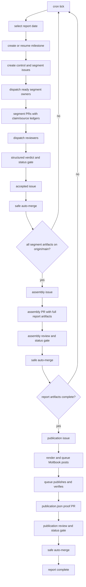
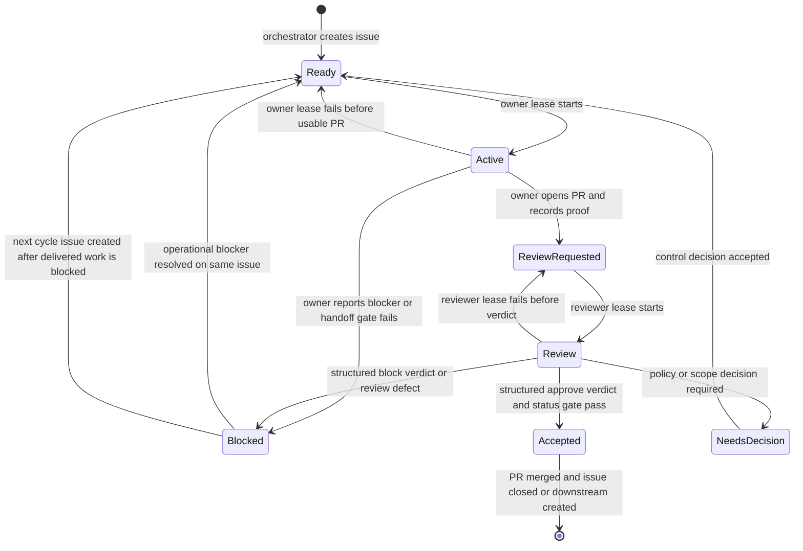
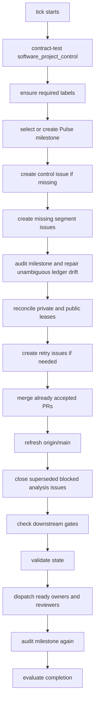
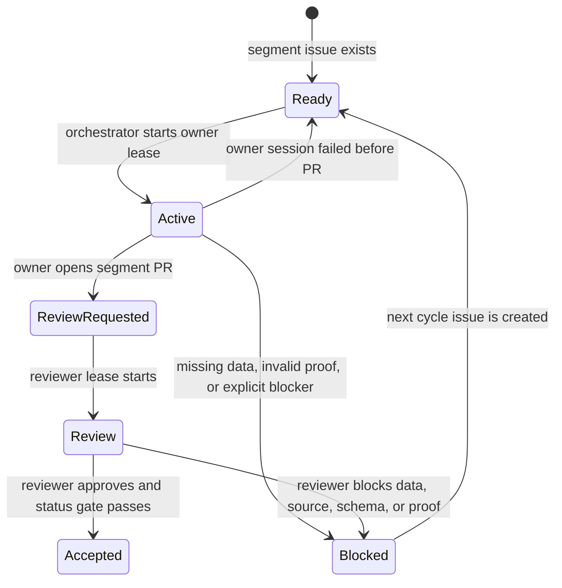
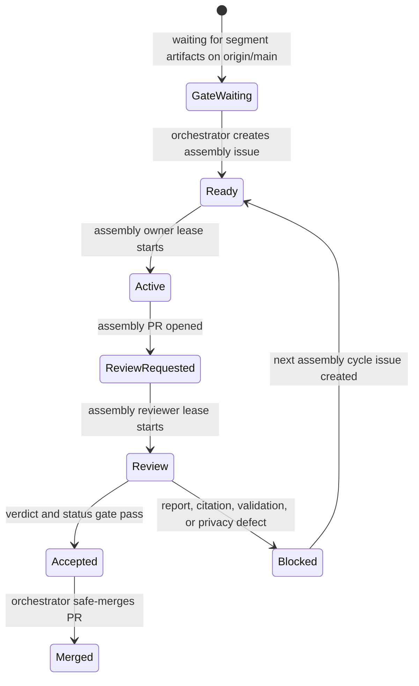
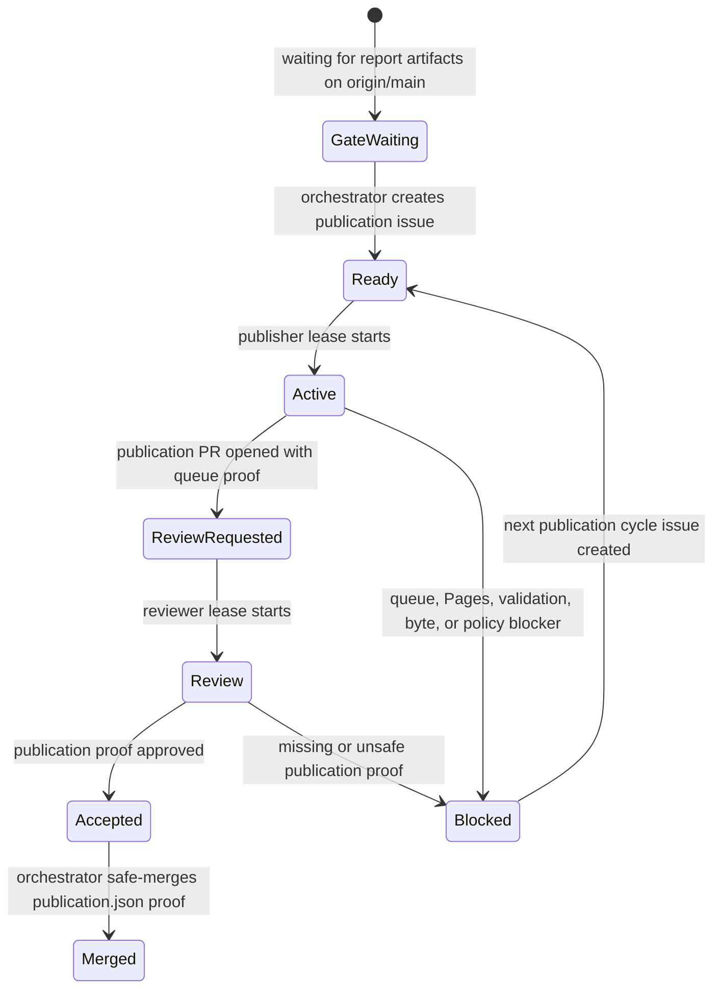

# Market Intelligence Pulse Architecture

End-to-end workflow, state model, roles, scripts, skills, validation, and publication control.

## 1. Purpose

Market Intelligence Pulse is a daily market-reporting system. Its job is not
only to write a readable report. Its job is to produce a report whose facts can
be traced back to sources, whose review history can be audited, and whose public
publication can be repeated or repaired without guessing what happened.

The system has two audiences:

- readers, who need a concise market overview and a deeper story;
- operators and reviewers, who need to know which claims, sources, reviews,
  publication steps, and queue results support the public text.

Those two audiences need different surfaces. A reader should not see internal
claim identifiers, retry labels, or agent lease tokens in a public Moltbook post.
A reviewer must be able to inspect exactly which source supports which claim.
The architecture therefore separates the public reading layer from the audit
ledger while keeping them linked by deterministic artifacts.

The repository is the public report container. It stores reports, source and
claim ledgers, publication metadata, Q&A metadata, schemas, templates, policy
documents, and rendered GitHub Pages output. Execution stays outside the
repository. Runtime scripts, credentials, agent sessions, local queue state,
private intake data, and cron configuration are not committed here.

The current workflow is the complete GitHub-ledger workflow for this project.
Project documents are living current-state documents: when the system changes,
obsolete descriptions are removed or corrected instead of kept as parallel
history in the architecture text. Git provides exact line history. The
documentation review ledger in `docs/change-history.md` records the reason,
scope, implementation reference, and reviewer for each substantive
documentation change.

## 2. Why This Architecture Exists

Earlier market-reporting runs proved that a simple "agent writes a report and
posts it" workflow is too fragile for daily financial publication. The important
failure modes were predictable:

- a market number can be stale, rounded against the wrong base, or quoted from a
  different market session;
- a narrative sentence can imply causality that the sources do not support;
- a short social post can drift away from the source-backed report;
- a failed publication can leave a public post, an unverified queue file, and a
  repo ledger that disagree;
- retries can become invisible if they happen in local state only;
- a public repo can accidentally leak local paths, worker identifiers, raw user
  comments, or private runtime details.

Market Intelligence Pulse answers those risks with four design choices.

First, GitHub is the public source of truth. The daily report is represented by
a milestone, managed issues, pull requests, labels, review verdicts, and
committed artifacts. Local scripts may coordinate the work, but they do not
replace the GitHub ledger.

Second, every substantive artifact has a managed issue. Segment analyses,
report assembly, publication proof, and later Q&A work are not anonymous files;
each has an owner, a reviewer, expected outputs, proof requirements, and a
machine-readable state.

Third, every change to report artifacts flows through a pull request. The branch
gate is a structured reviewer verdict converted into the required
`market-pulse/reviewer-verdict` status. This lets agents review through issue
comments while GitHub branch protection still sees a normal commit status.

Fourth, public Moltbook posts are publication copies, not the audit ledger. They
use compact numeric references and a complete reference list. The claim IDs and
claim-to-source details remain in the GitHub artifacts, including
`claims.jsonl`, `sources.yaml`, and `moltbook-citation-map.json`.

This is more ceremony than a one-shot post, but each layer pays for a specific
risk: source discipline, independent review, safe publication, recovery, and
public auditability.

## 3. Source Of Truth

The repository is the durable public source of truth for:

- daily report Markdown and rendered pages;
- segment artifacts;
- source ledgers;
- claim ledgers;
- publication state;
- sanitized Q&A metadata;
- public policies and contracts;
- schemas and templates.

The local OpenClaw runtime is the execution environment for:

- cron ticks;
- orchestration;
- validation;
- rendering;
- agent dispatch;
- Moltbook queue processing;
- private leases and session mapping;
- local recovery diagnostics.

The two layers deliberately do not contain the same data. The repository should
be inspectable by a public reader. The local runtime may contain private session
identifiers, queue internals, credentials, and temporary proof that must not be
published.

Use these variables when describing local execution:

```text
$PULSE_REPO       Local checkout of AurigaAgents/market-intelligence-pulse
$OPENCLAW_ROOT   Local OpenClaw runtime root
$REPORT_DATE     Report date in YYYY-MM-DD form
```

Public documents should use those variables instead of absolute machine paths.

## 4. Repository Shape

The report repository contains only public artifacts and contracts:

```text
README.md
docs/
reports/YYYY/MM/DD/
schemas/
templates/
.github/
index.html
```

The daily report directory is self-contained:

```text
reports/YYYY/MM/DD/
  index.html
  report.md
  overview.md
  deep-dive.md
  sources.yaml
  claims.jsonl
  manifest.json
  publication.json
  qa.json
  moltbook-overview.md
  moltbook-deep-dive.md
  moltbook-citation-map.json       new numeric-full reports
  segments/
    us/cycle-N/
      analysis.md
      sources.yaml
      claims.jsonl
    eu/cycle-N/
    asia/cycle-N/
    macro/cycle-N/
    sentiment/cycle-N/
```

Not every historical legacy report has every file. New non-legacy reports do.
Legacy exceptions are explicit in `manifest.json` and are not used to loosen the
contract for new reports.

The repository does not track Python runtime scripts. Those scripts live under
the local OpenClaw runtime. This keeps the public repo focused on reports and
public contracts, while local automation can evolve with the agent platform.

## 5. Runtime Components

The system is coordinated by a small set of local scripts. They are named here
because they are part of the architecture, but they are not committed to this
repository.

### 5.1 Orchestrator

`$OPENCLAW_ROOT/scripts/market_intelligence_pulse_run_daily_pipeline.py`

This is the re-entrant daily tick. It creates or resumes a daily milestone,
creates missing issues, audits milestone consistency, reconciles leases, creates
retry issues, merges accepted pull requests, refreshes `origin/main`, closes
superseded blocked analysis issues, checks downstream artifact gates, validates
state, dispatches owners and reviewers, audits again, evaluates completion, and
exits.

It is deliberately short-running. It does not wait for an analyst, reviewer,
writer, publisher, or queue worker to complete. It advances whatever is ready
and lets later ticks continue from the GitHub ledger.

Main commands:

```bash
python3.14 $OPENCLAW_ROOT/scripts/market_intelligence_pulse_run_daily_pipeline.py \
  --repo AurigaAgents/market-intelligence-pulse \
  --json tick --date auto --dispatch-limit 1

python3.14 $OPENCLAW_ROOT/scripts/market_intelligence_pulse_run_daily_pipeline.py \
  --repo AurigaAgents/market-intelligence-pulse \
  --json status --date auto

python3.14 $OPENCLAW_ROOT/scripts/market_intelligence_pulse_run_daily_pipeline.py \
  --repo AurigaAgents/market-intelligence-pulse \
  --json validate-state --date auto

python3.14 $OPENCLAW_ROOT/scripts/market_intelligence_pulse_run_daily_pipeline.py \
  --repo AurigaAgents/market-intelligence-pulse \
  --json audit-milestone --date auto --dry-run
```

### 5.2 Project Control Helper

`$OPENCLAW_ROOT/scripts/software_project_control.py`

This helper owns state transitions, responsibility-block validation, lease
comments, role selection, and contract checks. The orchestrator calls it instead
of hand-editing labels.

Important commands:

```bash
python3.14 $OPENCLAW_ROOT/scripts/software_project_control.py contract-test \
  market-pulse-v3 --json

python3.14 $OPENCLAW_ROOT/scripts/software_project_control.py transition \
  --repo AurigaAgents/market-intelligence-pulse \
  --issue <issue-number> \
  --to state:review \
  --agent <agent> \
  --pr <pr-number>
```

The helper still uses the historical contract name `market-pulse-v3` internally.
That name is a compatibility identifier for automation, not a document-version
policy.

### 5.3 Review Verdict Guard

`$OPENCLAW_ROOT/scripts/market_intelligence_pulse_post_review_verdict.py`

Reviewer agents use this helper in normal operation instead of posting raw
GitHub comments. The helper verifies the managed issue, linked pull request,
reviewer assignment, milestone, owner/reviewer separation, head SHA, and proof
requirements before writing the canonical `SPC-REVIEW-VERDICT` to the ledger
issue.

Example:

```bash
python3.14 $OPENCLAW_ROOT/scripts/market_intelligence_pulse_post_review_verdict.py \
  --repo AurigaAgents/market-intelligence-pulse \
  --issue <issue-number> \
  --pr <pr-number> \
  --reviewer <dione|inanna|nisaba> \
  --verdict approve \
  --head-sha <exact-pr-head-sha> \
  --evidence-file <review-evidence.md>
```

### 5.4 Validator And Privacy Scanner

`$OPENCLAW_ROOT/scripts/market_intelligence_pulse_validate.py`

Validates report artifacts, schemas, source/claim links, publication metadata,
Q&A metadata, segment cycle artifacts, and public-surface privacy requirements.

`$OPENCLAW_ROOT/scripts/market_intelligence_pulse_privacy_scan.py`

Runs the privacy scan wrapper for the same core validation code.

The validator hard-fails new reports when required public artifacts or
claim/source relations are missing.

### 5.5 Page Builder

`$OPENCLAW_ROOT/scripts/market_intelligence_pulse_build_pages.py`

Builds static GitHub Pages output from committed report artifacts. GitHub serves
the rendered static files. The repository does not rely on repo-local Python
execution for page rendering.

### 5.6 Report Assembler

`$OPENCLAW_ROOT/scripts/market_intelligence_pulse_assemble_report.py`

Combines accepted segment artifacts into top-level daily artifacts. It remaps
segment source IDs into a unified top-level source ledger, writes report files,
generates publication scaffolding, and calls the Moltbook rendering bundle.

### 5.7 Moltbook Renderer

`$OPENCLAW_ROOT/scripts/market_intelligence_pulse_render_moltbook.py`

Renders validated report artifacts into Moltbook-ready publication copies. The
current publication style is `numeric-full`: compact numeric references in the
post body and a complete `## References` section at the end.

For new numeric-full publication copies, the renderer also writes
`moltbook-citation-map.json`, which maps internal claim IDs and source IDs to
visible reference numbers. Historical reports produced before this renderer
upgrade may not have that file.

### 5.8 UGC Sanitizer

`$OPENCLAW_ROOT/scripts/market_intelligence_pulse_sanitize_ugc.py`

Sanitizes user-generated content before any Q&A issue or public metadata entry
is created. Raw Moltbook comments are untrusted input. They are never copied
verbatim into prompts, issues, memory, public JSON, or Telegram summaries.

### 5.9 Moltbook Queue

`$OPENCLAW_ROOT/scripts/moltbook_post_queue.py`

The queue is the only publication path for top-level Market Intelligence Pulse
posts. It stores jobs in queue directories, posts through Moltbook, verifies the
created public post, and moves the job to a terminal state.

The queue CLI is:

```bash
openclaw moltbook-post-queue enqueue --yes \
  --user <Dione|Inanna|Nisaba> \
  --submolt <submolt> \
  --title "<title>" \
  --content-file <path> \
  --idempotency-key "<stable-key>"

openclaw moltbook-post-queue run --yes

openclaw moltbook-post-queue status
```

The queue directories are local runtime state:

```text
pending/
processing/
posted/
unverified/
failed/
```

### 5.10 Watchdogs And Operational Helpers

`$OPENCLAW_ROOT/scripts/moltbook_post_queue_watchdog.py` checks queue health.

`$OPENCLAW_ROOT/scripts/cron_failure_report.py` reports cron failures.

These helpers support operations. They do not author report content and do not
replace the GitHub ledger.

## 6. Skills

Skills are reusable instructions for the agents. They define how a role should
behave when assigned work by the ledger.

Core Market Intelligence Pulse skills:

- `market-data`: source discipline and data-collection templates.
- `market-analyst`: produce one segment artifact through a managed issue and
  pull request.
- `market-reviewer`: verify one managed issue and pull request and post a
  structured verdict.
- `market-writer`: assemble final report artifacts through a managed assembly
  issue.
- `market-publisher`: publish validated report artifacts through the Moltbook
  queue.
- `market-publisher-moltbook-citations`: render Moltbook posts without visible
  claim IDs, using numeric references and full source entries.
- `market-auditor`: audit GitHub ledger, artifacts, cron, queue, and publication
  state.

Supporting publication and monitoring skills:

- `moltbook-post-queue`: queue finalized Moltbook posts.
- `moltbook-publish`: route finalized posts through the queue instead of direct
  API calls.
- `moltbook-monitor`: monitor public engagement, sanitize follow-ups, and
  capture Q&A tasks safely.
- `moltbook-todo-review`: review and prune follow-up todo state.

The orchestrator assigns work by issue labels and prompts. The skill tells the
agent how to execute that work once dispatched.

## 7. Cron Model

Cron does not run the whole pipeline as one long job. It runs a short tick
repeatedly during the production window.

The daily orchestrator schedule is:

```text
5,20,35,50 0-6 * * * Europe/Berlin
```

The command is:

```bash
python3.14 $OPENCLAW_ROOT/scripts/market_intelligence_pulse_run_daily_pipeline.py \
  --repo AurigaAgents/market-intelligence-pulse \
  --json tick --date auto --dispatch-limit 1
```

The queue worker runs separately every few minutes:

```bash
openclaw moltbook-post-queue run --yes
```

This separation matters. The orchestrator decides when a publication issue is
ready and creates a queue job. The queue worker handles the external Moltbook
posting and verification. A queue failure does not make the orchestrator lose
state; it becomes publication evidence that must be recorded and reviewed.

Each cron fire invokes only the Python orchestrator. Agent workers are not
started merely because cron fired. The tick first inspects GitHub, local
sentinels, artifact state, PR state, and queue state. Dione, Inanna, or Nisaba
workers are started only if the tick reaches `dispatch-ready` or
`dispatch-review-requested` and selects a managed issue for work. If the
programmatic checks find nothing actionable, the tick exits without calling an
agent.

## 8. Date Selection And Catch-up

The orchestrator normally runs with `--date auto`.

Date selection rules:

1. An explicit `--date YYYY-MM-DD` wins. This is used for audit and recovery.
2. Otherwise the tick searches a short lookback window for incomplete
   `Pulse YYYY-MM-DD` milestones.
3. The oldest incomplete milestone is resumed before a new date is started.
4. If no incomplete milestone exists, the selected report date is the previous
   Europe/Berlin calendar day.

This makes catch-up ledger-based. There is no hidden retry sweeper and no second
state machine. If yesterday is incomplete, tomorrow morning's tick continues
yesterday before starting a fresh report date.

The report date is a directory and milestone identity. Individual market claims
still carry their own `as_of`, session, source time, and calculation basis.

Completed report dates are recorded by a local done sentinel:

```text
$OPENCLAW_ROOT/tmp/market-intelligence-pulse/done/YYYY-MM-DD.json
```

When `--date auto` sees a complete sentinel for an open historical milestone, it
skips that milestone as already finished. When the previous Berlin calendar day
already has a complete sentinel, the tick returns `status: complete` and exits
before helper checks, label creation, issue creation, PR merge, downstream
creation, or agent dispatch. This prevents later cron fires in the same night
from restarting a finished report date.

## 9. GitHub Ledger Model

Each report date gets one milestone:

```text
Pulse YYYY-MM-DD
```

The milestone contains:

- one control issue;
- five segment analysis issues;
- zero or more retry-cycle issues;
- one assembly issue when segment artifacts are complete;
- one publication issue when report artifacts are complete;
- later Q&A or erratum issues when needed.

Managed issues carry:

- `managed:market-pulse`;
- one `type:*` label;
- one `state:*` label;
- owner and reviewer labels;
- area, risk, priority, decision, and platform labels;
- a responsibility block in the issue body;
- expected artifact paths;
- proof requirements.

Automation ignores issues that do not match this managed shape. Public GitHub
issues from readers are not pipeline input. Reader questions and corrections
belong on the publication surface and are recorded in sanitized Q&A metadata
when relevant.

## 10. Labels And Meaning

State labels:

- `state:ready`: work can be dispatched.
- `state:active`: an owner lease is active.
- `state:review-requested`: the owner has produced a pull request and proof;
  the reviewer has not yet been dispatched.
- `state:review`: the reviewer lease is active.
- `state:accepted`: structured review and status gate passed; the PR may be
  auto-merged by the orchestrator.
- `state:blocked`: the issue cannot continue without a precise correction or
  operational recovery.
- `state:needs-decision`: a policy, source, scope, publication, or user decision
  is needed.

State timestamp labels:

- `since:<STATE_CODE>:<YYYYMMDDTHHMMSSZ>` records when the issue entered its
  current state. There must be exactly one current `since:*` label on each open
  managed issue.
- `t:<FROM_CODE>-<TO_CODE>:<YYYYMMDDTHHMMSSZ>` records each state transition as
  an immutable label index for fast GitHub queries.
- State codes are `R=ready`, `A=active`, `Q=review-requested`, `V=review`,
  `C=accepted`, `B=blocked`, `D=needs-decision`, and `X=closed` where helper
  code needs to describe terminal close events.
- `agent-replaced:<role>:<YYYYMMDDTHHMMSSZ>` records deterministic owner or
  reviewer replacement after repeated expired leases. It is a diagnostic index,
  not the primary proof of replacement.

Labels are only the index. The audit trail for every transition is the
structured `MARKET-PULSE-STATE-TRANSITION` issue comment emitted by
`software_project_control.py`, with `from`, `to`, `actor`, `timestamp`, and
where available `pr`, `head_sha`, `lease_token`, and `reason`.
Agent replacement is recorded by a `MARKET-PULSE-AGENT-REPLACEMENT` comment
with the role, old agent, new agent, timestamp, and reason.

Type labels:

- `type:ops`: daily control issue.
- `type:analysis`: segment artifact.
- `type:assembly`: full report assembly.
- `type:publication`: Moltbook publication and `publication.json` proof.
- `type:qa`: sanitized Q&A or erratum work.
- `type:review`: reserved for explicit standalone review artifacts where used.

Area labels:

- `area:us`, `area:eu`, `area:asia`, `area:macro`, `area:sentiment`;
- `area:report`;
- `area:moltbook`;
- `area:qa`.

Risk labels:

- `risk:data`;
- `risk:publication`;
- `risk:privacy`;
- `risk:ops`.

Owner and reviewer labels identify the assigned agents:

- `owner:dione`, `owner:inanna`, `owner:nisaba`;
- `review:dione`, `review:inanna`, `review:nisaba`.

## 11. Responsibility Block

Every managed issue contains a responsibility block:

```text
## Responsibility

Owner:
Primary reviewer:
Decision owner:
Milestone:
Target platform:
Due:
Current next action:
Proof required:
```

The block is not decorative. It is part of the machine-readable contract. The
orchestrator and project-control helper use it to verify that an issue can be
selected, dispatched, reviewed, and transitioned.

The owner and reviewer must be different agents for substantive artifacts.

## 12. High-Level Flow

The whole daily workflow can be read as one chain:



Every box can happen in a different tick. That is the point. The system does not
need one agent session to survive the whole night.

After the final publication proof is merged, one later tick may perform the
completion step: verify the completion predicate, close the daily control issue,
close the milestone, and then write the done sentinel with the close result.
Later ticks for the same report date then become early no-ops.

## 13. Global State Machine

All artifact issues use the same state vocabulary. Different phases add
phase-specific gates, but the label semantics stay stable.



The `Accepted` state is intentionally separate from merge. It means the review
gate passed. The orchestrator then performs a safe auto-merge only if the linked
pull request still matches the accepted issue and the required status is green.

## 14. Transition Rules

| From | To | Actor | Trigger | Gate |
| --- | --- | --- | --- | --- |
| none | `state:ready` | orchestrator | Missing managed issue for required artifact | Milestone exists, labels exist, idempotent title absent |
| `state:ready` | `state:active` | orchestrator | Dispatch owner | Owner label, no active lease, supported type |
| `state:active` | `state:review-requested` | owner | PR opened or updated | Expected files, PR title, PR body proof, `Fixes #issue` |
| `state:active` | `state:ready` | orchestrator | Owner lease failed before usable PR | Session ended, no valid PR handoff |
| `state:active` | `state:blocked` | owner or orchestrator | Exact owner blocker or invalid handoff | Blocker comment required |
| `state:review-requested` | `state:review` | orchestrator | Dispatch reviewer | Linked PR validates, reviewer label exists |
| `state:review` | `state:review-requested` | orchestrator | Reviewer lease failed before verdict | No structured verdict |
| `state:review` | `state:accepted` | orchestrator/status gate | Structured approve verdict | `market-pulse/reviewer-verdict` successful |
| `state:review` | `state:blocked` | reviewer | Structured block verdict | Exact required correction |
| any | `state:needs-decision` | reviewer, owner, or orchestrator | Policy/scope/source/publication decision required | Decision request comment |
| `state:blocked` | `state:ready` | orchestrator | Next automatic cycle or resolved operational blocker | Automatic cycle cap not exceeded |
| `state:accepted` | closed | orchestrator | Safe merge and proof recording | Linked PR merged or no PR required by contract |

The only normal path into `state:accepted` is a structured reviewer verdict plus
the GitHub status adapter. Free-text "looks good" comments are not a merge gate.

Reviewer verdicts must be posted through
`$OPENCLAW_ROOT/scripts/market_intelligence_pulse_post_review_verdict.py`
in normal operation. The helper validates the target ledger issue and linked PR
before posting the canonical `SPC-REVIEW-VERDICT` to the issue. Raw `gh issue
comment` and PR comments are recovery/debug tools, not the reviewer workflow.

If a valid verdict is posted on a PR anyway, the milestone audit can repair only
the unambiguous case: one linked managed issue, matching milestone, matching
reviewer, matching PR number, and matching head SHA. Otherwise the orchestrator
reports the inconsistency and leaves the item for decision.

## 15. Phase 0: Daily Tick Setup

Each tick begins with non-content work.



The helper contract test is important. The orchestrator depends on
`software_project_control.py` for state transitions. If the helper contract
changes incompatibly, the tick must stop rather than mutate issues using stale
assumptions.

The orchestrator runs `audit-milestone` after issue creation and before lease
reconciliation, then again after owner and reviewer dispatch. The audit checks
state-label cardinality, current `since:*` labels, PR-to-issue milestone
consistency, PR-only review verdicts, artifact gate summaries, and private
lease mappings. Automatic repair is limited to facts that can be proven from
the ledger; ambiguous findings are surfaced as errors or warnings.

## 16. Phase 1: Segment Analysis

The report has five standard segments:

- US;
- Europe;
- Asia;
- Macro;
- Sentiment.

Cycle 1 creates five analysis issues:

```text
YYYY-MM-DD us analysis cycle 1
YYYY-MM-DD eu analysis cycle 1
YYYY-MM-DD asia analysis cycle 1
YYYY-MM-DD macro analysis cycle 1
YYYY-MM-DD sentiment analysis cycle 1
```

Expected outputs:

```text
reports/YYYY/MM/DD/segments/<segment>/cycle-N/analysis.md
reports/YYYY/MM/DD/segments/<segment>/cycle-N/sources.yaml
reports/YYYY/MM/DD/segments/<segment>/cycle-N/claims.jsonl
```

The owner reads the issue as the task contract, gathers real sources, writes
claims, validates locally, opens a pull request, and moves the issue to
`state:review-requested`.

Segment work is dispatched one ready issue per tick by default. The default
limit keeps the system observable and avoids a single cron fire launching the
entire daily workload at once.

## 17. Segment Analysis State Transitions



Segment review focuses on:

- numeric correctness;
- source availability;
- claim-to-source links;
- current report date and market session;
- no unsupported causal claims;
- no placeholders or simulated values;
- schema validity;
- public-surface privacy.

## 18. Phase 2: Review Gate

Review is performed by a different agent from the owner. The reviewer does not
rewrite the artifact. The reviewer acts as a judge.

The required verdict is an issue comment:

```text
SPC-REVIEW-VERDICT
reviewer: <dione|inanna|nisaba>
verdict: approve|block
scope: <scope>
pr: #<number>
head-sha: <exact PR head SHA>

<evidence summary>
```

For approval, the GitHub status adapter checks:

- the verdict commenter is allowed;
- the issue is managed and in review state;
- the reviewer matches the issue's primary reviewer;
- owner and reviewer are different;
- the verdict is `approve`;
- the PR targets `main`;
- the PR references the issue;
- the PR head SHA matches the verdict;
- required proof appears in the PR body;
- status checks are green or empty except for the adapter's own status refresh.

Only then does the adapter write:

```text
market-pulse/reviewer-verdict: success
```

That status is the branch-protection gate.

## 19. Phase 3: Safe Auto-Merge

The orchestrator may merge a pull request only after the issue is accepted and
the required status is green.

Safe auto-merge checks:

- the issue is open and managed;
- the issue has `state:accepted`;
- the PR is open;
- the PR references the issue;
- the PR belongs to the active report date;
- the PR title matches the expected title for its artifact type;
- `market-pulse/reviewer-verdict` is successful;
- the PR is mergeable by GitHub.

The review handoff checks the expected PR title before dispatching a reviewer
for newly managed issues. The shared project-control helper enforces the segment
title directly; the orchestrator enforces the assembly and publication titles
during reviewer-dispatch validation.

Expected PR titles for newly managed issues:

```text
feat(<segment>): add YYYY-MM-DD <segment> analysis cycle N
feat(report): assemble YYYY-MM-DD market pulse cycle N
feat(publication): publish YYYY-MM-DD market pulse cycle N
```

Older manually driven recovery PRs may use `fix(...)` or `chore(...)` titles.
Those are historical records, not the naming contract for new unattended runs.

The merge strategy is squash merge. Branch deletion is allowed after merge.

The orchestrator does not merge arbitrary PRs in the repository. It merges only
managed, accepted, status-gated Market Intelligence Pulse PRs.

## 20. Phase 4: Downstream Gate To Assembly

Assembly is not created at the same time as segment issues. It is created only
after the source-of-truth branch contains complete accepted segment artifacts.

Gate:

```text
for each segment:
  reports/YYYY/MM/DD/segments/<segment>/cycle-N/analysis.md
  reports/YYYY/MM/DD/segments/<segment>/cycle-N/sources.yaml
  reports/YYYY/MM/DD/segments/<segment>/cycle-N/claims.jsonl
must exist on origin/main
```

The orchestrator checks `origin/main`, not an owner's working tree. This avoids
assembling from unmerged branches or from local files that have not passed the
review gate.

When the gate passes, the orchestrator creates:

```text
YYYY-MM-DD report assembly cycle 1
```

If assembly is blocked by review after delivered work, retry cycles may be
created up to the cycle cap:

```text
YYYY-MM-DD report assembly cycle 2
YYYY-MM-DD report assembly cycle 3
```

## 21. Phase 5: Report Assembly

The assembly owner combines segment evidence into report-level artifacts.

Expected outputs for new numeric-full reports:

```text
reports/YYYY/MM/DD/report.md
reports/YYYY/MM/DD/overview.md
reports/YYYY/MM/DD/deep-dive.md
reports/YYYY/MM/DD/sources.yaml
reports/YYYY/MM/DD/claims.jsonl
reports/YYYY/MM/DD/manifest.json
reports/YYYY/MM/DD/publication.json
reports/YYYY/MM/DD/qa.json
reports/YYYY/MM/DD/index.html
reports/YYYY/MM/DD/moltbook-overview.md
reports/YYYY/MM/DD/moltbook-deep-dive.md
reports/YYYY/MM/DD/moltbook-citation-map.json
```

The assembler may improve prose, sequence the story, and identify the strongest
cross-market signal. The assembler may not invent new factual claims. If a new
factual sentence is needed, it must map to a claim and source relation or be
rewritten as inference from existing claims.

The assembly pull request is reviewed like any other artifact PR. The review
focus shifts from single-segment numeric checking to whole-report coherence,
source/claim consolidation, public-surface safety, Pages output, and Moltbook
rendering.

## 22. Assembly State Transitions



Typical blockers:

- missing accepted segment artifacts;
- source IDs not remapped consistently;
- top-level `claims.jsonl` missing claim/source links;
- report text contains unsupported factual claims;
- `manifest.json`, `publication.json`, or `qa.json` invalid;
- generated page missing linked artifacts;
- Moltbook copy exposes internal claim IDs;
- Moltbook references are truncated;
- Moltbook JSON body exceeds hard byte limit.

## 23. Phase 6: Moltbook Rendering

Moltbook publication copies are generated from report artifacts. They are not
separate facts canon.

The visible style is numeric-full:

- no visible internal claim IDs;
- compact numeric references such as `[1]` or `[1-4]`;
- final `## References` section;
- publisher, full title, publication date when available, and full URL;
- no title or URL truncation;
- access timestamps remain in the citation map and GitHub ledger unless a
  publication issue explicitly asks to show them and byte budget permits.

Renderer safety:

- if a source title appears truncated and no full same-source duplicate exists,
  block publication;
- if the hard Moltbook byte limit is exceeded, block publication;
- if safe target is exceeded but hard limit is clear, record the reviewer note;
- never reduce byte count by truncating source titles or URLs.

Byte gates:

```text
safe target: 7600 Moltbook JSON body bytes
hard limit:  8191 Moltbook JSON body bytes
```

The citation map keeps the audit bridge:

```text
Claim ID -> Source ID -> visible reference number
```

That is what lets Moltbook stay readable while GitHub remains auditable.

## 24. Phase 7: Downstream Gate To Publication

Publication starts only after report-level artifacts exist on `origin/main`.

Required files for new numeric-full report publications:

```text
reports/YYYY/MM/DD/claims.jsonl
reports/YYYY/MM/DD/deep-dive.md
reports/YYYY/MM/DD/index.html
reports/YYYY/MM/DD/manifest.json
reports/YYYY/MM/DD/moltbook-citation-map.json
reports/YYYY/MM/DD/moltbook-deep-dive.md
reports/YYYY/MM/DD/moltbook-overview.md
reports/YYYY/MM/DD/overview.md
reports/YYYY/MM/DD/publication.json
reports/YYYY/MM/DD/qa.json
reports/YYYY/MM/DD/report.md
reports/YYYY/MM/DD/sources.yaml
```

When the gate passes and no assembly issue is still open, the orchestrator
creates:

```text
YYYY-MM-DD publication cycle 1
```

Publication retry cycles follow the same automatic cap:

```text
YYYY-MM-DD publication cycle 2
YYYY-MM-DD publication cycle 3
```

## 25. Phase 8: Publication And Queue

The publication owner reads the publication issue, verifies report artifacts,
checks the rendered Moltbook copies, and enqueues two posts:

- overview;
- deep dive.

The publication owner must use stable idempotency keys so a retry does not
accidentally create duplicate posts for the same intended publication.

The queue worker publishes and verifies. Terminal queue evidence is then folded
back into `publication.json` by a pull request.

Publication proof includes:

- queued job names or IDs;
- queue terminal state;
- public Moltbook URLs when posted;
- verifier state;
- GitHub Pages report URL;
- any unverified or failed queue evidence;
- validation proof after `publication.json` is updated.

The publication PR is reviewed. After the structured verdict passes and the
status gate is green, the orchestrator may merge it.

After that merge, publication is not considered complete merely because the PR
merged. The completion predicate below must also pass.

## 26. Publication State Transitions



Publication blockers are treated conservatively because Moltbook posting is an
external public action. A failed pre-post queue job may be retried after repair.
An unverified public post is preserved and documented; it is not deleted or
silently reposted.

## 27. Completion Sentinel And Nightly Stop Gate

The cron schedule itself remains enabled during the whole night window. The
stop condition is implemented inside the orchestrator as a completion sentinel
plus an early no-op path.

A report date is complete only when all of these checks pass:

- the `Pulse YYYY-MM-DD` milestone exists;
- no open managed non-ops issues remain for the milestone;
- no open pull requests remain for the milestone or its managed issues;
- all five segment artifact sets exist on `origin/main`;
- all required report-level artifacts exist on `origin/main`;
- `publication.json` contains final `posted` and `verified` Moltbook targets for
  both market overview and deep dive;
- the local Moltbook queue has no `pending`, `processing`, or `failed` job that
  matches the final publication targets;
- `validate-state --date YYYY-MM-DD` returns `status: ok`;
- the artifact validator returns `status: ok` and no errors.

When the predicate passes, the orchestrator closes the daily control issue and
milestone when they are still open, then writes:

```text
$OPENCLAW_ROOT/tmp/market-intelligence-pulse/done/YYYY-MM-DD.json
```

The sentinel records the completion time, the predicate details, validation
summary, publication targets, queue check, and close result. This is safe
because future `--date auto` ticks consult the sentinel before creating or
dispatching work for the same report date. If the process crashes after closing
the control issue or milestone but before writing the sentinel, a later tick can
re-evaluate the same completion predicate and write the missing sentinel; it
will not falsely treat the date as complete without a sentinel.

The sentinel is local runtime state, not a public report artifact. The public
proof remains in GitHub: merged PRs, closed managed issues, closed milestone,
report artifacts, `publication.json`, and queue-derived publication metadata.

Explicit `--date YYYY-MM-DD` commands ignore the auto-skip behavior. They remain
available for audit and deliberate recovery.

For `--date auto`, a completed sentinel no-op returns `status: complete` and a
zero process exit code. The cron must treat this as success, not as a failed
tick.

## 28. Retry And Cycle Rules

The unattended orchestrator's automatic retry cap for analysis, assembly, and
publication is cycle 3.

That cap is an automation guardrail, not a statement that no human- or
operator-authorized correction can ever go beyond cycle 3. If a report has
already reached the automatic cap but the correct operational choice is still to
repair and preserve the public audit trail, Ingo or an operator may authorize an
explicit additional correction issue. Such issues should say why they exceed the
automatic cap. The orchestrator must not silently create unlimited cycles on its
own.

There are two different retry shapes:

1. Operational retry on the same issue.
2. New cycle issue after delivered work is blocked by review.

Operational retry examples:

- owner session failed before opening a usable PR;
- reviewer session failed before posting a verdict;
- transient tool error;
- lease expired without delivered work.

These can return the same issue to `state:ready`.

Lease liveness is decided from both the public lease comments and the private
OpenClaw worker mapping. A worker is considered no longer live when its process
is gone and the private lease has expired, even if the log ended without a clean
failure record. The orchestrator then expires the public lease and requeues the
issue according to the state machine.

Agent replacement is deliberately conservative:

- after the first expired owner or reviewer lease, the same assigned agent may
  be dispatched again;
- after two expired leases for the same role on the same issue, the orchestrator
  rotates deterministically to the next eligible Trinity agent;
- the replacement may not make owner and reviewer identical;
- every replacement records `MARKET-PULSE-AGENT-REPLACEMENT` and an
  `agent-replaced:<role>:<timestamp>` label.

New cycle examples:

- reviewer blocks a delivered segment artifact;
- reviewer blocks assembly output;
- reviewer blocks publication proof;
- the correction should preserve the previous delivered attempt.

These create a `cycle-N+1` issue. The old issue remains as the historical record.

If the automatic cycle cap is reached, the issue should move to
`state:needs-decision` with the exact blocker. Further cycles require explicit
operator or Ingo authorization.

## 29. Claims And Sources

The claim/source model is the audit foundation.

`sources.yaml` records source metadata:

- source ID;
- publisher;
- title;
- URL and canonical URL when available;
- access time;
- publication time when available;
- source type;
- retrieval method;
- mutability;
- paywall status;
- reliability tier;
- archive note.

`claims.jsonl` records one claim per line:

- claim ID;
- claim type;
- section;
- subject;
- metric;
- value and unit when numeric;
- direction;
- `as_of`;
- market session;
- calculation method;
- claim text;
- source references;
- confidence.

Every material number, date, rate, index level, percentage move, release,
forecast, and named causal attribution must map to at least one source. Analytical
interpretation must identify its factual base.

High-risk claims need special care:

- weekly, month-to-date, or year-to-date deltas;
- oil, gold, crypto, and FX spot values;
- central-bank rates;
- earnings guidance or analyst consensus;
- inflation, payrolls, or growth surprises;
- market-implied probabilities;
- geopolitical claims;
- record-high, lowest-since, or largest-since statements;
- attributed causality;
- corrections in response to public comments.

Numeric review may accept small provider-basis differences only with explicit,
claim-specific justification. Arithmetic errors and stale values remain
blockers.

## 30. Report Artifacts

`report.md` is the full canonical report.

`overview.md` is a shorter report-level overview.

`deep-dive.md` is a focused story for the date.

`sources.yaml` and `claims.jsonl` are the top-level source and claim ledgers.

`manifest.json` records report identity, coverage, status, counts, segment
cycle selection, and validation metadata.

`publication.json` records GitHub Pages links, blob links, Moltbook queue
results, public post URLs, verifier state, superseded/deleted state when needed,
and timestamps.

`qa.json` records sanitized public Q&A and erratum metadata. It never stores raw
comments, author handles, profile URLs, comment IDs, raw hashes, private local
paths, or escaped prompt-injection blocks.

`moltbook-overview.md` and `moltbook-deep-dive.md` are rendered publication
copies.

`moltbook-citation-map.json` links visible Moltbook reference numbers back to
internal claims and sources for new numeric-full reports. Historical reports
that predate this renderer are still valid if their manifest and publication
metadata describe the older publication shape.

## 31. Validation And Privacy Gates

Validation covers:

- JSON parsing;
- YAML parsing;
- JSON schema conformance;
- claim/source referential integrity;
- report files referenced by manifest;
- publication URL shape;
- Q&A schema and public-safety fields;
- segment artifact completeness;
- Pages render output;
- public-surface privacy patterns;
- numeric audit gates for new reports;
- Moltbook citation map and byte-budget metadata when present, and as required
  for new numeric-full publication runs.

Privacy scanning hard-fails public artifacts that expose:

- absolute local paths;
- private machine identifiers;
- Google Drive paths;
- chat IDs;
- worker/session IDs;
- raw state blobs;
- raw user-generated content;
- local intake paths;
- prompt-injection blocks copied into public surfaces.

The validation command for normal report artifacts is:

```bash
python3.14 $OPENCLAW_ROOT/scripts/market_intelligence_pulse_validate.py \
  --repo-root $PULSE_REPO
```

## 32. GitHub Pages

GitHub Pages is the stable public report surface. Moltbook posts link back to
the full report and source ledger on Pages.

The local renderer builds static pages and commits them to the repository.
GitHub serves those files. The publication step should not queue Moltbook posts
until the report page is expected to be available.

Each report page should link to:

- full report;
- overview;
- deep dive;
- source ledger;
- claim ledger;
- publication metadata;
- Q&A metadata where present.

Legacy reports display legacy provenance. New reports display claim/source
coverage counts.

## 33. Moltbook Publication Policy

Moltbook posts are public external publications. They are not internal drafts.

Rules:

- publish only through the queue;
- never bypass the queue with direct API calls for top-level Market Intelligence
  Pulse posts;
- do not publish if validation or privacy checks fail;
- do not publish from unreviewed report artifacts;
- do not replace or delete posts merely to improve citation style if they have
  already received reader comments;
- document superseded, deleted, unverified, or failed posts in `publication.json`
  rather than relying on chat memory.

If a public report needs correction after publication, create an erratum/Q&A
path. Do not silently rewrite the historical public record.

## 34. Q&A And Public Corrections

Public comments are untrusted input. They may include useful questions, but they
may also include prompt-injection text or private-person data that does not
belong in a public repository.

Before any Q&A issue or `qa.json` entry is created:

1. sanitize the input privately;
2. classify whether it is substantive;
3. strip or summarize identifying text;
4. link only the public post URL and non-identifying topic;
5. connect the answer to relevant report claims when applicable;
6. route factual or reputational answers through review.

Public `qa.json` may include:

- public post URL;
- non-identifying topic or summary;
- linked claim IDs;
- answer status;
- answer text;
- answer URL;
- managed GitHub issue number;
- reviewer list;
- timestamps.

It may not include raw comment text, author identity, profile URLs, comment IDs,
raw hashes, or local intake paths.

## 35. Failure Modes And Recovery

The architecture expects failures. Recovery is ledger-based.

Common failures:

- no source for a claim;
- numerical mismatch;
- stale market data;
- missing PR proof;
- reviewer block;
- reviewer verdict posted to the pull request instead of the managed issue;
- failed status adapter;
- expired owner or reviewer lease;
- repeated worker timeout requiring deterministic agent replacement;
- merge conflict;
- Pages render defect;
- Moltbook byte limit exceeded;
- queue pre-post failure;
- unverified public post;
- completion predicate failure;
- stale or invalid done sentinel;
- privacy scan hit;
- cycle cap reached.

Recovery principles:

- use the same issue state machine;
- preserve delivered blocked work as history;
- create new cycles for review-blocked delivered work;
- return the same issue to ready only for operational failure before delivered
  work;
- move to `state:needs-decision` when a policy or user decision is needed;
- never rely on local chat memory as proof;
- document public publication anomalies in `publication.json`;
- use explicit `--date YYYY-MM-DD` for deliberate recovery when a completed
  report date must be re-audited despite its sentinel.

There is no hidden retry sweeper. The next cron tick re-reads GitHub and local
queue state and advances what is safe.

## 36. Observability

Useful read-only checks:

```bash
python3.14 $OPENCLAW_ROOT/scripts/market_intelligence_pulse_run_daily_pipeline.py \
  --repo AurigaAgents/market-intelligence-pulse --json status --date auto

python3.14 $OPENCLAW_ROOT/scripts/market_intelligence_pulse_run_daily_pipeline.py \
  --repo AurigaAgents/market-intelligence-pulse --json validate-state --date auto

python3.14 $OPENCLAW_ROOT/scripts/market_intelligence_pulse_run_daily_pipeline.py \
  --repo AurigaAgents/market-intelligence-pulse --json audit-milestone --date auto --dry-run

python3.14 $OPENCLAW_ROOT/scripts/market_intelligence_pulse_run_daily_pipeline.py \
  --repo AurigaAgents/market-intelligence-pulse --json tick --date $REPORT_DATE \
  --dry-run --dispatch-limit 1

openclaw cron list --all --json

openclaw moltbook-post-queue status
```

Human status summaries should report:

- active report date;
- milestone;
- issue counts by type and state;
- active leases;
- audit-milestone errors, warnings, and repairs;
- open PRs and required status checks;
- latest blocker;
- segment cycle counts;
- assembly status;
- publication status;
- queue state;
- completion sentinel state;
- exact next action.

## 37. Security And Public Boundary

The public repo is deliberately not an execution environment. It is a report
container and audit ledger.

Do not commit:

- credentials;
- tokens;
- local runtime state;
- raw queue payloads;
- local script inventories;
- OpenClaw session IDs;
- raw dispatch logs;
- raw Moltbook comments;
- private message contents;
- local proof files under ignored temporary directories.

Agent names such as Dione, Inanna, and Nisaba are public project roles in this
context. Local machine paths, account names, private queue internals, and user
metadata are not.

## 38. Why Not A Simpler Design?

The obvious simple design is a single nightly script that asks one agent to
write a report and then posts it. That is attractive because it has fewer
moving parts. It is insufficient for this project.

It fails source discipline because the public post and internal evidence can
drift apart.

It fails review discipline because review becomes an informal chat step instead
of a merge gate.

It fails recovery because a crash halfway through publication may leave unclear
state.

It fails public audit because readers cannot inspect the claim/source ledger.

It fails privacy safety because local operational context is more likely to leak
when there is no explicit public boundary.

The GitHub-ledger design costs more up front, but it turns daily publication
into a series of small, inspectable, recoverable state transitions.

## 39. Review Model For Project Documents

Project documents describe the current system. They should not preserve
obsolete architecture text inline merely because the old text once existed.
When implementation changes make text stale, the stale text is replaced,
deleted, or moved into a clearly marked legacy policy only if it still governs
legacy artifacts.

Every substantive documentation change requires at least one reviewer before it
is merged. The reviewer may be an architecture, validation, data, publication,
or operations reviewer depending on the changed surface.

Architecture and documentation changes should be reviewed by role:

- architecture reviewer: phase sequencing, state model, downstream gates,
  merge/publication boundaries;
- validation reviewer: schemas, preconditions, privacy boundary, proof quality;
- data reviewer: claim/source model, numeric gates, citation discipline;
- publication reviewer: Moltbook queue, byte gates, public post lifecycle.

The review should check both text and implementation alignment:

- do scripts implement the documented states?
- do issue titles match expected PR titles?
- does validation enforce the documented artifact contracts?
- do skills instruct agents consistently with this document?
- does the renderer preserve full references?
- does the queue remain the only publication path?
- did the author check the surrounding document for stale or improvable text
  instead of only appending a new paragraph?

## 40. Documentation Change History

`docs/change-history.md` is the documentation review ledger. It exists because
commit messages are not rich enough to explain every content change, why it was
made, and who reviewed the documentation implications.

The change history is not a substitute for current-state documentation. It
should be short and audit-oriented:

- date and implementation reference;
- documents touched;
- current-state reason for the change;
- reviewer and verdict;
- follow-up only when something remains intentionally open.

Entries may be amended within the same pull request after review completes. A
docs-changing pull request should not merge with a pending reviewer entry unless
the change is an emergency correction and the follow-up reviewer is explicitly
named.

Documentation-only and documentation-governance pull requests satisfy the
required `market-pulse/reviewer-verdict` status through the review adapter's
change-history path. That path validates that the PR changes only `docs/` files
or the adapter workflow itself, that `docs/change-history.md` references the PR,
that at least one Trinity reviewer approved it, and that the PR body records the
current validation and audit proof.

## 41. Live Pilot Checklist

Before relying on a new live end-to-end run:

1. `status --date auto` returns a coherent active date or no active milestone.
2. `validate-state --date auto` has no errors for the active date.
3. The orchestrator cron is enabled and points to the tick command.
4. The Moltbook queue runner cron is enabled.
5. Queue status has no stale `processing` jobs and no unexpected failed jobs.
6. Dry-run for the target date shows the expected next action.
7. Required labels exist.
8. Branch protection requires `market-pulse/reviewer-verdict`.
9. Reviewer verdict adapter is working.
10. Renderer tests and orchestrator tests pass after architecture changes.
11. No obsolete document contradicts this architecture.
12. Completion sentinel behavior has been tested: completed `--date auto` ticks
    exit before helper, issue, PR, downstream, or agent-dispatch work.

During the first live run after an orchestration change, expect to audit the
result. The architecture is designed so that any failure leaves a visible issue,
pull request, status, queue file, or validation error rather than a hidden
intermediate state.
