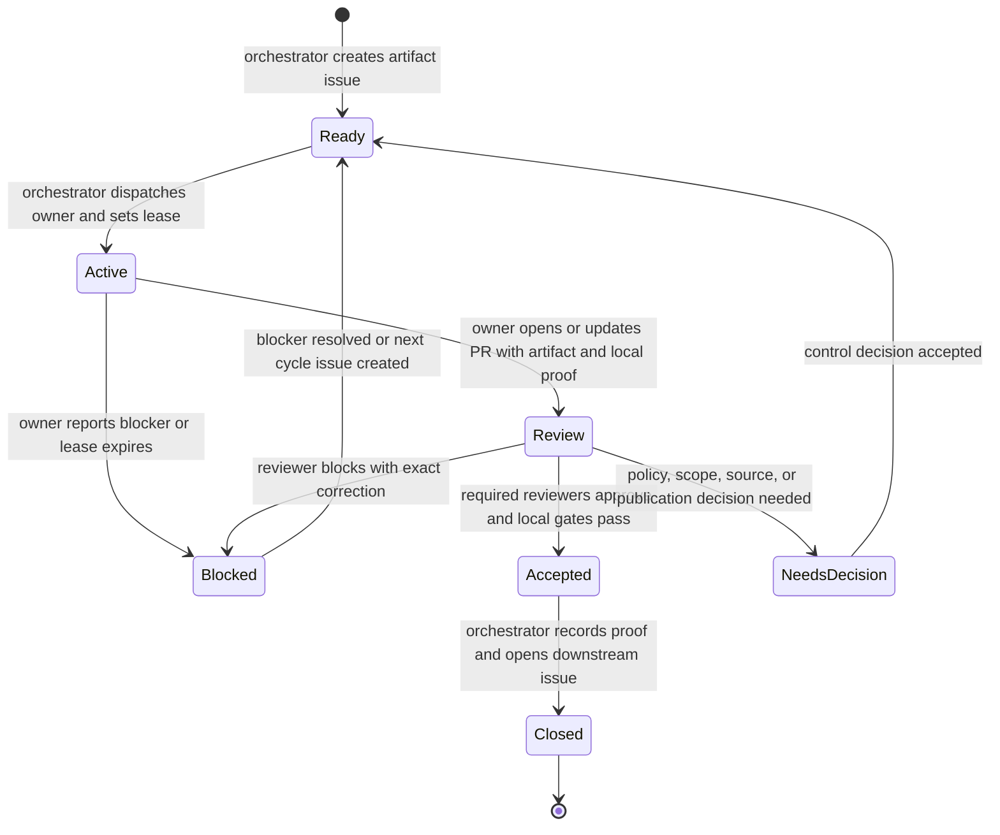

# Orchestrator State Machine

State labels are changed only through the shared project-control helper. Free-text comments may explain a verdict, but native pull request review state is the machine-readable approval signal for PR-backed artifacts.

Leases are public-safe issue comments. Tick locks are private local runtime state and are not stored in this repository.
