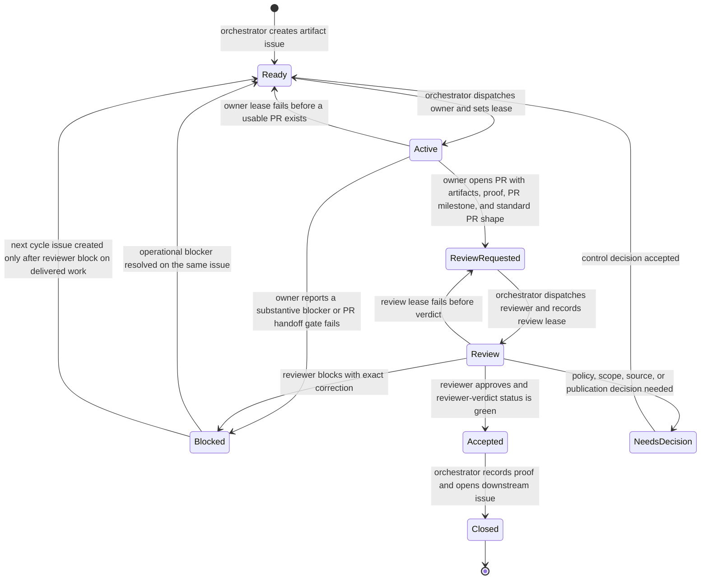

# Orchestrator State Machine

State labels are changed only through the shared project-control helper.
`state:review-requested` means the owner is done and a reviewer must now be
dispatched; `state:review` means a named reviewer has actually accepted a
review lease and is working. Free-text comments may explain a verdict, but the
machine-readable acceptance gate is the structured `SPC-REVIEW-VERDICT`
combined with a successful `market-pulse/reviewer-verdict` commit status.

Leases are public-safe issue comments. Tick locks are private local runtime state and are not stored in this repository.
